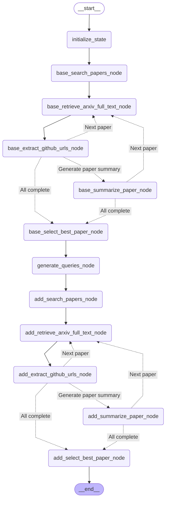
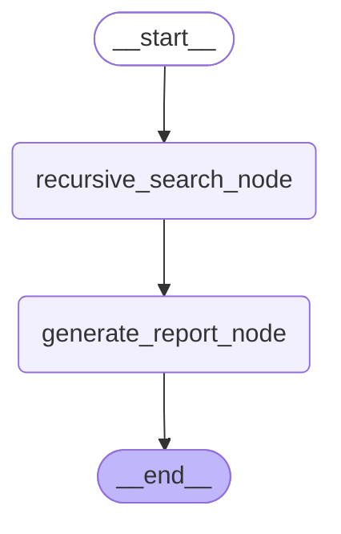
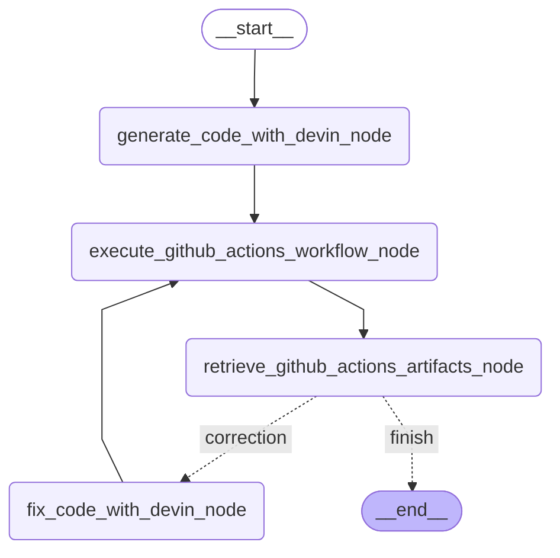

# ResearchGraph

ResearchGraphは完全な研究の自動化を目的としたOSSになります．

## ResearchGraph
全てのサブグラフを実行します．(現在はDeep Research Subgraphを組み込めていません)

```python
python src/researchgraph/research_graph.py
```

<details>

<summary>Architecture</summary>


</details>


## Retrieve paper subgraph
ベースにする研究論文とそれに追加する技術の論文を取得するためのサブグラフです．

```python
python src/researchgraph/retrieve_paper_subgraph/retrieve_paper_subgraph.py
```


<details>

<summary>Architecture</summary>


</details>


## Deep Research Subgraph
Web上から情報を取得するためのサブグラフです．

```python
python src/researchgraph/deep_research_subgraph/deep_research_subgraph.py
```


<details>

<summary>Architecture</summary>


</details>


## Integrate Generator Subgraph
手法を合成するためのサブグラフです．

```python
python src/researchgraph/integrate_generator_subgraph/integrate_generator_subgraph.py
```


<details>

<summary>Architecture</summary>


</details>


## Executor Subgraph
新規の手法をコーディングし実行するためのサブグラフです．

```python
python src/researchgraph/executor_subgraph/executor_subgraph.py
```


<details>

<summary>Architecture</summary>


</details>


## Writer Subgraph
論文を執筆するためのサブグラフです．執筆した論文はGitHub上にアップロードされます．

```python
python src/researchgraph/writer_subgraph/writer_subgraph.py
```


<details>

<summary>Architecture</summary>


</details>
