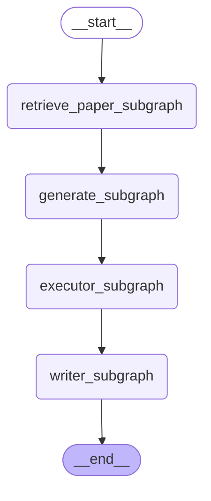
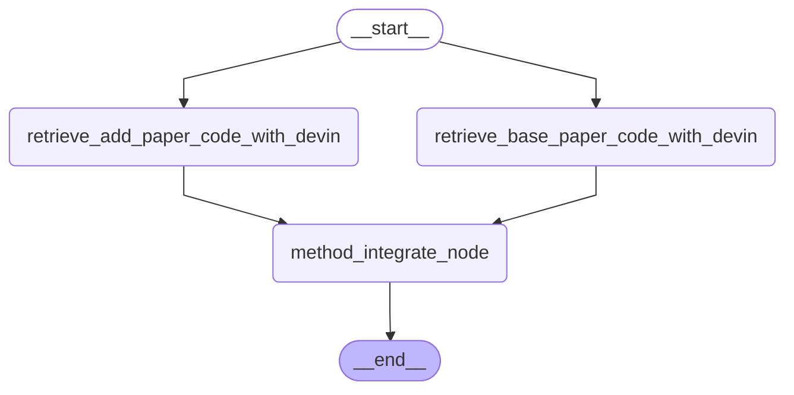
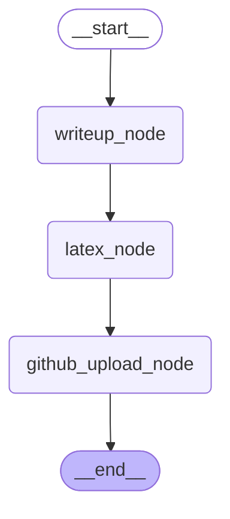

# ResearchGraph
ResearchGraph is created by [AutoRes](https://www.autores.one/english).
ResearchGraph is an OSS that aims to automate complete machine learning research and to self-improve the automatic research system.  
ResearchGraphは[AutoRes](https://www.autores.one/japanese)というプロジェクトで作成しています．
ResearchGraphは完全な機械学習研究の自動化および，自動研究システムの自己改善を目的としたOSSになります．

## Explanation


### ResearchGraph Architecture

<details>

<summary>Architecture</summary>



</details>


- Deep Research Subgraph
Web上から情報を取得するためのサブグラフです．

<details>

<summary>Architecture</summary>


</details>


- Generator Subgraph
手法を合成するためのサブグラフです．

<details>

<summary>Architecture</summary>


</details>


- Executor Subgraph
新規の手法をコーディングし実行するためのサブグラフです．

<details>

<summary>Architecture</summary>


</details>


- Writer Subgraph
論文を執筆するためのサブグラフです．執筆した論文はGitHub上にアップロードされます．

<details>

<summary>Architecture</summary>


</details>


### Result
The following is a repository that summarizes the results of ResearchGraph.
- [auto-research](https://github.com/auto-res2/auto-research)


## Settings


## How to execute
- Research Graph
```python
python src/researchgraph/research_graph.py
```
- Deep Research Subgraph
```python
python src/researchgraph/deep_research_subgraph/deep_research_subgraph.py
```
- Generate Subgraph
```python
python src/researchgraph/integrate_generator_subgraph/integrate_generator_subgraph.py
```
- Executor Subgraph
```python
python src/researchgraph/executor_subgraph/executor_subgraph.py
```
- writer subgraph
```python
python src/researchgraph/writer_subgraph/writer_subgraph.py
```
