# ResearchGraph
ResearchGraph is created by [AutoRes](https://www.autores.one/english).
ResearchGraph is an OSS that aims to automate complete machine learning research and to self-improve the automatic research system.  
ResearchGraphは[AutoRes](https://www.autores.one/japanese)というプロジェクトで作成しています．
ResearchGraphは完全な機械学習研究の自動化および，自動研究システムの自己改善を目的としたOSSになります．


## Architecture

```mermaid
%%{init: {'flowchart': {'curve': 'linear'}}}%%
graph TD;
        __start__([<p>__start__</p>]):::first
        retrieve_paper_subgraph_initialize_state(initialize_state)
        retrieve_paper_subgraph_base_web_scrape_node(base_web_scrape_node)
        retrieve_paper_subgraph_base_extract_paper_title_node(base_extract_paper_title_node)
        retrieve_paper_subgraph_base_search_arxiv_node(base_search_arxiv_node)
        retrieve_paper_subgraph_base_retrieve_arxiv_full_text_node(base_retrieve_arxiv_full_text_node)
        retrieve_paper_subgraph_base_extract_github_urls_node(base_extract_github_urls_node)
        retrieve_paper_subgraph_base_summarize_paper_node(base_summarize_paper_node)
        retrieve_paper_subgraph_base_select_best_paper_node(base_select_best_paper_node)
        retrieve_paper_subgraph_generate_queries_node(generate_queries_node)
        retrieve_paper_subgraph_add_web_scrape_node(add_web_scrape_node)
        retrieve_paper_subgraph_add_extract_paper_title_node(add_extract_paper_title_node)
        retrieve_paper_subgraph_add_search_arxiv_node(add_search_arxiv_node)
        retrieve_paper_subgraph_add_retrieve_arxiv_full_text_node(add_retrieve_arxiv_full_text_node)
        retrieve_paper_subgraph_add_extract_github_urls_node(add_extract_github_urls_node)
        retrieve_paper_subgraph_add_summarize_paper_node(add_summarize_paper_node)
        retrieve_paper_subgraph_add_select_best_paper_node(add_select_best_paper_node)
        retrieve_paper_subgraph_prepare_state(prepare_state)
        generator_subgraph(generator_subgraph)
        experimental_plan_subgraph___start__(<p>__start__</p>)
        experimental_plan_subgraph_retrieve_code_with_devin_node(retrieve_code_with_devin_node)
        experimental_plan_subgraph_check_devin_completion_node(check_devin_completion_node)
        experimental_plan_subgraph_generate_advantage_criteria_node(generate_advantage_criteria_node)
        experimental_plan_subgraph_generate_experiment_details_node(generate_experiment_details_node)
        experimental_plan_subgraph_generate_experiment_code_node(generate_experiment_code_node)
        executor_subgraph_generate_code_with_devin_node(generate_code_with_devin_node)
        executor_subgraph_check_devin_completion_node(check_devin_completion_node)
        executor_subgraph_execute_github_actions_workflow_node(execute_github_actions_workflow_node)
        executor_subgraph_retrieve_github_actions_artifacts_node(retrieve_github_actions_artifacts_node)
        executor_subgraph_llm_decide_node(llm_decide_node)
        executor_subgraph_fix_code_with_devin_node(fix_code_with_devin_node)
        executor_subgraph___end__(<p>__end__</p>)
        writer_subgraph_generate_note_node(generate_note_node)
        writer_subgraph_writeup_node(writeup_node)
        writer_subgraph_latex_node(latex_node)
        upload_subgraph(upload_subgraph)
        make_execution_logs_data(make_execution_logs_data)
        __end__([<p>__end__</p>]):::last
        __start__ --> retrieve_paper_subgraph_initialize_state;
        executor_subgraph___end__ --> writer_subgraph_generate_note_node;
        experimental_plan_subgraph_generate_experiment_code_node --> executor_subgraph_generate_code_with_devin_node;
        generator_subgraph --> experimental_plan_subgraph___start__;
        make_execution_logs_data --> upload_subgraph;
        retrieve_paper_subgraph_prepare_state --> generator_subgraph;
        upload_subgraph --> __end__;
        writer_subgraph_latex_node --> make_execution_logs_data;
        subgraph retrieve_paper_subgraph
        retrieve_paper_subgraph_add_retrieve_arxiv_full_text_node --> retrieve_paper_subgraph_add_extract_github_urls_node;
        retrieve_paper_subgraph_add_search_arxiv_node --> retrieve_paper_subgraph_add_retrieve_arxiv_full_text_node;
        retrieve_paper_subgraph_add_web_scrape_node --> retrieve_paper_subgraph_add_extract_paper_title_node;
        retrieve_paper_subgraph_base_retrieve_arxiv_full_text_node --> retrieve_paper_subgraph_base_extract_github_urls_node;
        retrieve_paper_subgraph_base_search_arxiv_node --> retrieve_paper_subgraph_base_retrieve_arxiv_full_text_node;
        retrieve_paper_subgraph_base_select_best_paper_node --> retrieve_paper_subgraph_generate_queries_node;
        retrieve_paper_subgraph_base_web_scrape_node --> retrieve_paper_subgraph_base_extract_paper_title_node;
        retrieve_paper_subgraph_generate_queries_node --> retrieve_paper_subgraph_add_web_scrape_node;
        retrieve_paper_subgraph_initialize_state --> retrieve_paper_subgraph_base_web_scrape_node;
        retrieve_paper_subgraph_base_extract_paper_title_node -. &nbsp;Continue&nbsp; .-> retrieve_paper_subgraph_base_search_arxiv_node;
        retrieve_paper_subgraph_base_extract_github_urls_node -. &nbsp;Next paper&nbsp; .-> retrieve_paper_subgraph_base_retrieve_arxiv_full_text_node;
        retrieve_paper_subgraph_base_extract_github_urls_node -. &nbsp;Generate paper summary&nbsp; .-> retrieve_paper_subgraph_base_summarize_paper_node;
        retrieve_paper_subgraph_base_extract_github_urls_node -. &nbsp;All complete&nbsp; .-> retrieve_paper_subgraph_base_select_best_paper_node;
        retrieve_paper_subgraph_base_summarize_paper_node -. &nbsp;Next paper&nbsp; .-> retrieve_paper_subgraph_base_retrieve_arxiv_full_text_node;
        retrieve_paper_subgraph_base_summarize_paper_node -. &nbsp;All complete&nbsp; .-> retrieve_paper_subgraph_base_select_best_paper_node;
        retrieve_paper_subgraph_add_extract_paper_title_node -. &nbsp;Regenerate queries&nbsp; .-> retrieve_paper_subgraph_generate_queries_node;
        retrieve_paper_subgraph_add_extract_paper_title_node -. &nbsp;Continue&nbsp; .-> retrieve_paper_subgraph_add_search_arxiv_node;
        retrieve_paper_subgraph_add_extract_github_urls_node -. &nbsp;Next paper&nbsp; .-> retrieve_paper_subgraph_add_retrieve_arxiv_full_text_node;
        retrieve_paper_subgraph_add_extract_github_urls_node -. &nbsp;Generate paper summary&nbsp; .-> retrieve_paper_subgraph_add_summarize_paper_node;
        retrieve_paper_subgraph_add_extract_github_urls_node -. &nbsp;All complete&nbsp; .-> retrieve_paper_subgraph_add_select_best_paper_node;
        retrieve_paper_subgraph_add_summarize_paper_node -. &nbsp;Next paper&nbsp; .-> retrieve_paper_subgraph_add_retrieve_arxiv_full_text_node;
        retrieve_paper_subgraph_add_summarize_paper_node -. &nbsp;All complete&nbsp; .-> retrieve_paper_subgraph_add_select_best_paper_node;
        retrieve_paper_subgraph_add_select_best_paper_node -. &nbsp;Regenerate queries&nbsp; .-> retrieve_paper_subgraph_generate_queries_node;
        retrieve_paper_subgraph_add_select_best_paper_node -. &nbsp;Continue&nbsp; .-> retrieve_paper_subgraph_prepare_state;
        end
        subgraph experimental_plan_subgraph
        experimental_plan_subgraph___start__ --> experimental_plan_subgraph_generate_advantage_criteria_node;
        experimental_plan_subgraph___start__ --> experimental_plan_subgraph_retrieve_code_with_devin_node;
        experimental_plan_subgraph_check_devin_completion_node --> experimental_plan_subgraph_generate_experiment_details_node;
        experimental_plan_subgraph_generate_advantage_criteria_node --> experimental_plan_subgraph_generate_experiment_details_node;
        experimental_plan_subgraph_generate_experiment_details_node --> experimental_plan_subgraph_generate_experiment_code_node;
        experimental_plan_subgraph_retrieve_code_with_devin_node --> experimental_plan_subgraph_check_devin_completion_node;
        end
        subgraph executor_subgraph
        executor_subgraph_check_devin_completion_node --> executor_subgraph_execute_github_actions_workflow_node;
        executor_subgraph_execute_github_actions_workflow_node --> executor_subgraph_retrieve_github_actions_artifacts_node;
        executor_subgraph_fix_code_with_devin_node --> executor_subgraph_check_devin_completion_node;
        executor_subgraph_generate_code_with_devin_node --> executor_subgraph_check_devin_completion_node;
        executor_subgraph_retrieve_github_actions_artifacts_node --> executor_subgraph_llm_decide_node;
        executor_subgraph_llm_decide_node -. &nbsp;correction&nbsp; .-> executor_subgraph_fix_code_with_devin_node;
        executor_subgraph_llm_decide_node -. &nbsp;finish&nbsp; .-> executor_subgraph___end__;
        end
        subgraph writer_subgraph
        writer_subgraph_generate_note_node --> writer_subgraph_writeup_node;
        writer_subgraph_writeup_node --> writer_subgraph_latex_node;
        end
        classDef default fill:#f2f0ff,line-height:1.2
        classDef first fill-opacity:0
        classDef last fill:#bfb6fc
```

<details>

<summary>Architecture</summary>



</details>


## Settings

- Required API key
  - [OpenAI](https://platform.openai.com/settings/organization/api-keys)
  - [Devin](https://app.devin.ai/settings/api-keys)
  - [Firecrawl](https://www.firecrawl.dev/app/api-keys)
  - [GitHub personal access token](https://docs.github.com/ja/authentication/keeping-your-account-and-data-secure/managing-your-personal-access-tokens#fine-grained-personal-access-token-%E3%81%AE%E4%BD%9C%E6%88%90)

- Creating the .env file  
  Please set the API key as an environment variable.
  ```bash
  OPENAI_API_KEY=""
  DEVIN_API_KEY=""
  GITHUB_PERSONAL_ACCESS_TOKEN=""
  FIRE_CRAWL_API_KEY=""
  ```


## How to execute
```python
uv run python src/researchgraph/research_graph.py
```

## Result
The following is a repository that summarizes the results of ResearchGraph.
- [auto-research](https://github.com/auto-res2/auto-research)

