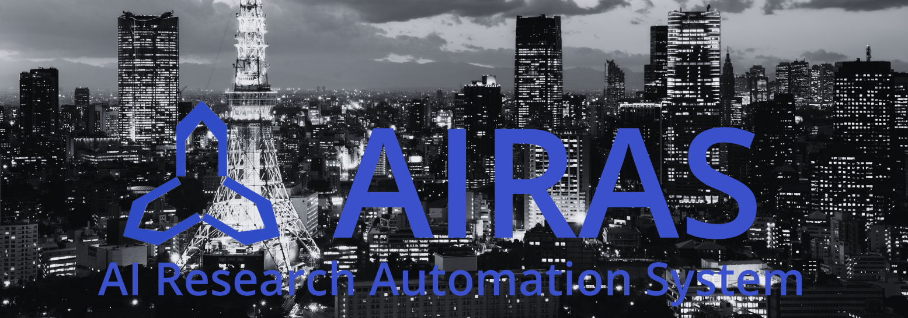

<!-- Title Image Placeholder -->


<p align="center">
  <a href="https://pypi.org/project/airas/">
    
  </a>
  <a href="https://auto-res.github.io/airas/">
    
  </a>
  <a href="https://github.com/auto-res/airas/blob/main/LICENSE">
    
  </a>
  <a href="https://x.com/fuyu_quant">
    
  </a>
</p>

🌐 AIRAS(AI Research Automation System) is a framework for automating AI research.

💡 See what others are building and share your projects in our [Discord](https://discord.gg/Qh5DmY6D)! 


# Quick Start

```bash
pip install airas
```


## MCP

Client setting in Claude Desktop
```json
{
    "mcpServers": {
        "researchgraph": {
            "type": "stdio",
            "command": "uv",
            "env": {
                "UV_ENV_FILE": "/PATH/TO/REPOSITORY/.env"
            },
            "args": [
                "--directory",
                "/PATH/TO/REPOSITORY",
                "run",
                "src/researchgraph/mcp_server/mcp_server.py"
            ]
        }
    }
}
```
or Visual Studio Code
```json
  "mcp": {
    "servers": {
      "researchgraph": {
        "type": "stdio",
        "command": "uv",
        "env": {
            "UV_ENV_FILE": "/PATH/TO/REPOSITORY/.env"
        },
        "args": [
            "--directory",
            "/PATH/TO/REPOSITORY",
            "run",
            "src/researchgraph/mcp_server/mcp_server.py"
        ]
      }
    }
  }
```

# Roadmap

- [ ] Enhanced automation for end-to-end ML research
- [ ] Improved integration with external APIs (OpenAI, Devin, Firecrawl, GitHub)
- [ ] User-friendly web interface
- [ ] Advanced experiment tracking and visualization
- [ ] Community plugin system

# Contact

We are exploring best practices for human-AI collaboration in automated AI research. Together, we're investigating how new research workflows—powered by both human insight and AI agents—can accelerate discovery, improve reproducibility, and give organizations a competitive edge in the age of autonomous research.

If you are interested in this topic, please feel free to contact us at <a href="mailto:ulti4929@gmail.com">ulti4929@gmail.com</a>.

# About AutoRes

This OSS is developed as part of the [AutoRes](https://www.autores.one/english) project.

# Citation

If you use AIRAS in your research, please cite as follows:

```
@software{airas2025,
  author = {Toma Tanaka, Wataru Kumagai, Takumi Matsuzawa, Yuki Yoshino, Ilya Horiguchi, Shiro Takagi, Ryutaro Yamauchi},
  title = {AIRAS},
  year = {2025},
  publisher = {GitHub},
  url = {https://github.com/auto-res/airas}
}
```
