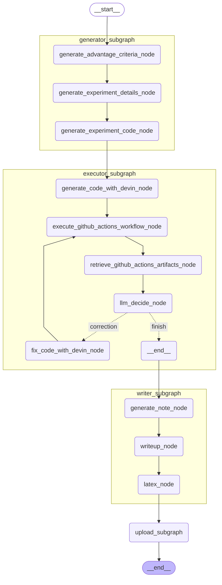

# ResearchGraph
ResearchGraph is created by [AutoRes](https://www.autores.one/english).
ResearchGraph is an OSS that aims to automate complete machine learning research and to self-improve the automatic research system.  
ResearchGraphは[AutoRes](https://www.autores.one/japanese)というプロジェクトで作成しています．
ResearchGraphは完全な機械学習研究の自動化および，自動研究システムの自己改善を目的としたOSSになります．

## Explanation


### ResearchGraph Architecture

<details>

<summary>Architecture</summary>



</details>

- Retriever Subgraph  
ベースにする研究論文を取得するためのサブグラフです．


- Generator Subgraph  
新規手法を生成するためのサブグラフです．


- Experimental Plan Subgraph  
実験計画をたて，コーディングを行うためのサブグラフです．

  <details>

  <summary>Architecture</summary>

  ```mermaid
  %%{init: {'flowchart': {'curve': 'linear'}}}%%
  graph TD;
          __start__([<p>__start__</p>]):::first
          generate_advantage_criteria_node(generate_advantage_criteria_node)
          generate_experiment_details_node(generate_experiment_details_node)
          generate_experiment_code_node(generate_experiment_code_node)
          __end__([<p>__end__</p>]):::last
          __start__ --> generate_advantage_criteria_node;
          generate_advantage_criteria_node --> generate_experiment_details_node;
          generate_experiment_code_node --> __end__;
          generate_experiment_details_node --> generate_experiment_code_node;
          classDef default fill:#f2f0ff,line-height:1.2
          classDef first fill-opacity:0
          classDef last fill:#bfb6fc
  ```
  </details>


- Executor Subgraph  
新規の手法を実行するためのサブグラフです．

  <details>

  <summary>Architecture</summary>

  ```mermaid
  %%{init: {'flowchart': {'curve': 'linear'}}}%%
  graph TD;
          __start__([<p>__start__</p>]):::first
          generate_code_with_devin_node(generate_code_with_devin_node)
          execute_github_actions_workflow_node(execute_github_actions_workflow_node)
          retrieve_github_actions_artifacts_node(retrieve_github_actions_artifacts_node)
          fix_code_with_devin_node(fix_code_with_devin_node)
          __end__([<p>__end__</p>]):::last
          __start__ --> generate_code_with_devin_node;
          execute_github_actions_workflow_node --> retrieve_github_actions_artifacts_node;
          fix_code_with_devin_node --> execute_github_actions_workflow_node;
          generate_code_with_devin_node --> execute_github_actions_workflow_node;
          retrieve_github_actions_artifacts_node -. &nbsp;correction&nbsp; .-> fix_code_with_devin_node;
          retrieve_github_actions_artifacts_node -. &nbsp;finish&nbsp; .-> __end__;
          classDef default fill:#f2f0ff,line-height:1.2
          classDef first fill-opacity:0
          classDef last fill:#bfb6fc
  ```
  </details>


- Writer Subgraph  
論文を執筆するためのサブグラフです．執筆した論文はGitHub上にアップロードされます．

  <details>

  <summary>Architecture</summary>

  ```mermaid
  %%{init: {'flowchart': {'curve': 'linear'}}}%%
  graph TD;
          __start__([<p>__start__</p>]):::first
          writeup_node(writeup_node)
          latex_node(latex_node)
          github_upload_node(github_upload_node)
          __end__([<p>__end__</p>]):::last
          __start__ --> writeup_node;
          github_upload_node --> __end__;
          latex_node --> github_upload_node;
          writeup_node --> latex_node;
          classDef default fill:#f2f0ff,line-height:1.2
          classDef first fill-opacity:0
          classDef last fill:#bfb6fc
  ```
  </details>


### Result
The following is a repository that summarizes the results of ResearchGraph.
- [auto-research](https://github.com/auto-res2/auto-research)


## Settings


## How to execute
- Research Graph
  ```python
  uv run python src/researchgraph/research_graph.py
  ```
- Experimental Plan Subgraph
  ```python
  uv run python /workspaces/researchgraph/src/researchgraph/experimental_plan_subgraph/experimental_plan_subgraph.py
  ```
- Executor Subgraph
  ```python
  uv run python src/researchgraph/executor_subgraph/executor_subgraph.py
  ```
- writer subgraph
  ```python
  uv run python src/researchgraph/writer_subgraph/writer_subgraph.py
  ```
