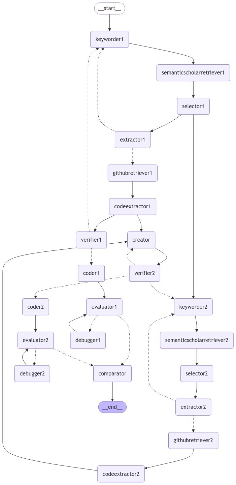
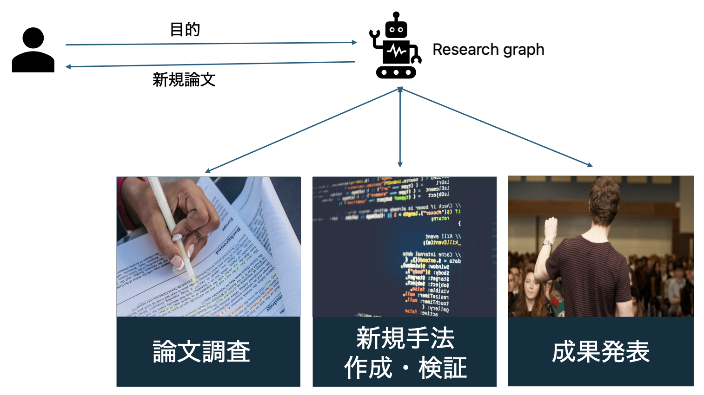

# ResearchGraph
ResearchGraphはAI研究の目的を与えるだけで、AIが完全自律的に調査・研究を行い、新たな手法の作成・検証を行うシステムです🤖。pipからライブラリをインストールするだけで使いことができます！  
ResearchGraphの特徴としては以下のものが挙げられます。
1. 自動研究によるサイクル  
   研究の全プロセスを自動化することができます。また研究サイクルを研究対象とすることによってシステムの最適化も行うことができます。
2. 仮想空間で閉じた学習  
   システムとして仮想空間内に閉じることによって、人間が介入しなくても良くなり、結果的に研究速度が向上します。

<p align="left">
  📖 <a href="https://arxiv.org/abs/2408.06292">[論文]</a> |
  💻 <a href="https://www.autores.one">[プロジェクトサイト]</a> |
</p>





## 目次

1. [インストール要件](#インストール要件)
2. [インストール方法](#インストール方法)
3. [利用ガイド](#利用ガイド)
4. [カスタマイズ](#カスタマイズ)
5. [サンプル](#サンプル)
6. [ライセンス](#ライセンス)
7. [引用方法](#引用方法)


## インストール要件

・Python >=3.10
・そのほか何かあれば


## インストール方法

最新のResearchGraphはpip経由でインストールすることができます。これによって新たに追加されたノードを活用することができます。
```bash
pip install --upgrade -q ResearchGraph
```


## 利用ガイド

論文中で実施した実験を例に、利用方法を記載します。

### LLM APIキーの設定

ResearchGraphで用いるLLMのAPIキーを以下のコードで指定します。

```bash
import os
os.environ["OPENAI_API_KEY"] = "ここに用いるAPIキーを入力"
```

ResearchGraphは様々なLLMに対応しており、利用者が好きなLLMを選択して利用することができます。ただし研究ではGPT-4oを活用しているため、それ以降のモデルの活用を推奨します。  
サポートしているLLMの一覧
| LLM提供 | モデル |
| ---- | ---- |
| OpenAI | GPT-4o<br> GPT-4<br> GPT-3.5|
| Claude | Claude-3.5-sonnet|

### 以降実行方法を追記する


ここに最終的に出力される手法などを記載する


## カスタマイズ

ResearchGraphのノードなどをカスタマイズで作成する方法など記載しますか？？

## サンプル

具体的な例を用いたResearchGraphの使用方法をGoogleColabNotebookに示します。  

1. 最適化手法の研究  
   ・目的として既存の最適化手法における計算コストの低減に向けた研究を実行します
2. ・・・

## ライセンス
ResearchGraphは〇〇ライセンスが適用されています。

## 引用方法
```
@inproceedings{shen2024variational,
      title={Variational Learning is Effective for Large Deep Networks}, 
      author={Yuesong Shen and Nico Daheim and Bai Cong and Peter Nickl and Gian Maria Marconi and Clement Bazan and Rio Yokota and Iryna Gurevych and Daniel Cremers and Mohammad Emtiyaz Khan and Thomas Möllenhoff},
      booktitle={International Conference on Machine Learning (ICML)},
      year={2024},
      url={https://arxiv.org/abs/2402.17641}
}
```


