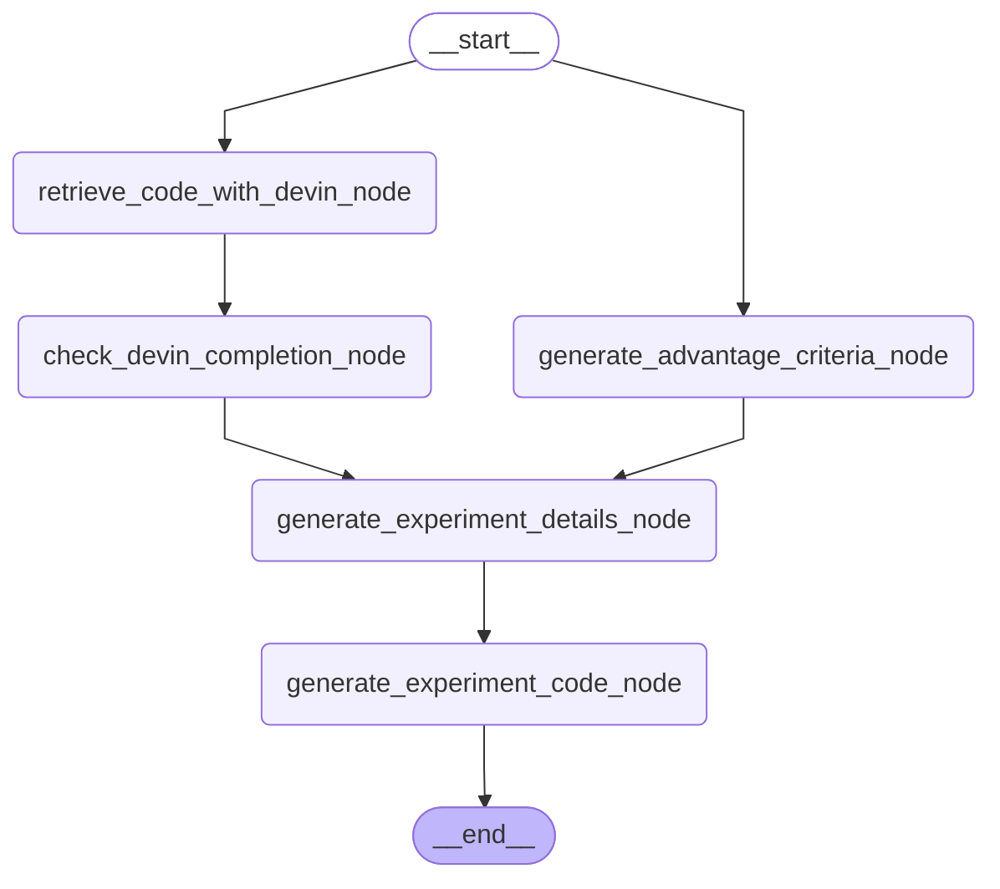

# Experimental Plan Subgraph  
実験計画をたて，コーディングを行うためのサブグラフです．

<details>

<summary>Architecture</summary>


</details>


## How to execute

```python
uv run python /workspaces/researchgraph/src/researchgraph/experimental_plan_subgraph/experimental_plan_subgraph.py
```
