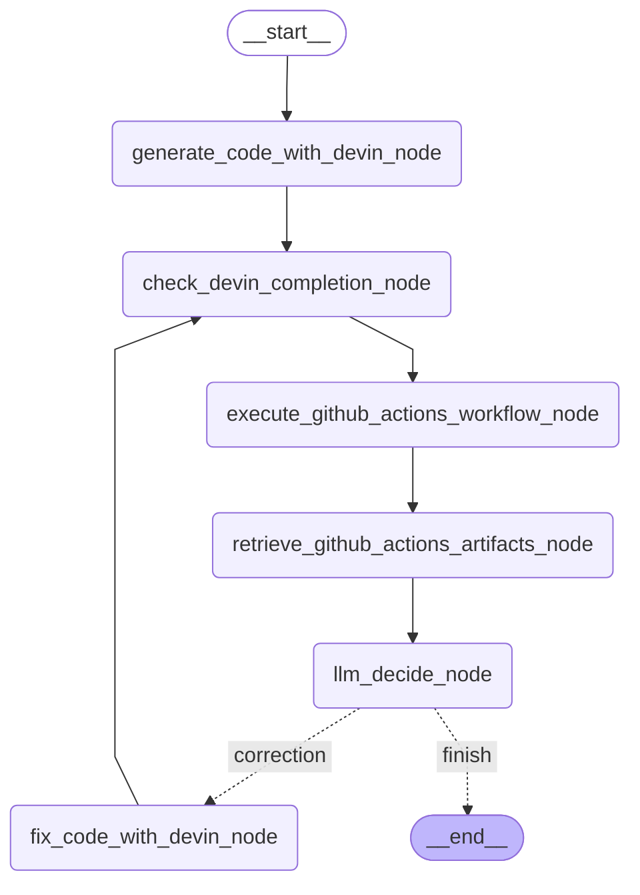

# Executor Subgraph  
新規の手法を実行するためのサブグラフです．

<details>

<summary>Architecture</summary>


```mermaid
%%{init: {'flowchart': {'curve': 'linear'}}}%%
graph TD;
        __start__([<p>__start__</p>]):::first
        generate_code_with_devin_node(generate_code_with_devin_node)
        check_devin_completion_node(check_devin_completion_node)
        execute_github_actions_workflow_node(execute_github_actions_workflow_node)
        retrieve_github_actions_artifacts_node(retrieve_github_actions_artifacts_node)
        llm_decide_node(llm_decide_node)
        fix_code_with_devin_node(fix_code_with_devin_node)
        __end__([<p>__end__</p>]):::last
        __start__ --> generate_code_with_devin_node;
        check_devin_completion_node --> execute_github_actions_workflow_node;
        execute_github_actions_workflow_node --> retrieve_github_actions_artifacts_node;
        fix_code_with_devin_node --> check_devin_completion_node;
        generate_code_with_devin_node --> check_devin_completion_node;
        retrieve_github_actions_artifacts_node --> llm_decide_node;
        llm_decide_node -. &nbsp;correction&nbsp; .-> fix_code_with_devin_node;
        llm_decide_node -. &nbsp;finish&nbsp; .-> __end__;
        classDef default fill:#f2f0ff,line-height:1.2
        classDef first fill-opacity:0
        classDef last fill:#bfb6fc
```
</details>


```python
uv run python src/researchgraph/executor_subgraph/executor_subgraph.py
```
