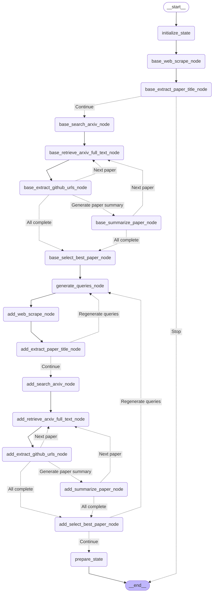

# Retriever Subgraph  
ベースにする研究論文を取得するためのサブグラフです．

<details>

<summary>Architecture</summary>


</details>

## How to execute

```python
uv run python src/researchgraph/retrieve_paper_subgraph/retrieve_paper_subgraph.py
```
