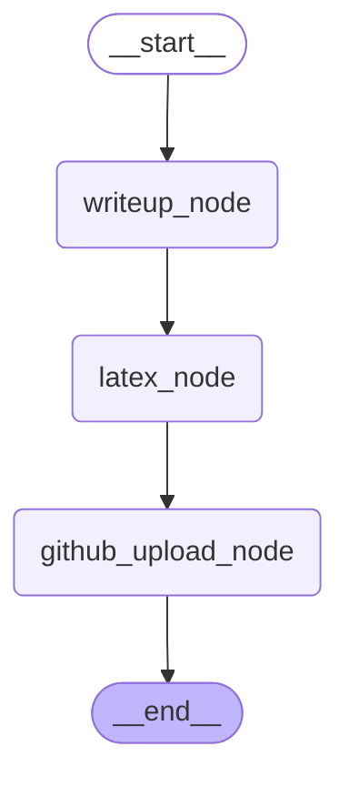

# Writer Subgraph  
論文を執筆するためのサブグラフです．執筆した論文はGitHub上にアップロードされます．

<details>

<summary>Architecture</summary>


</details>


## How to execute

```python
uv run python src/researchgraph/writer_subgraph/writer_subgraph.py
```
